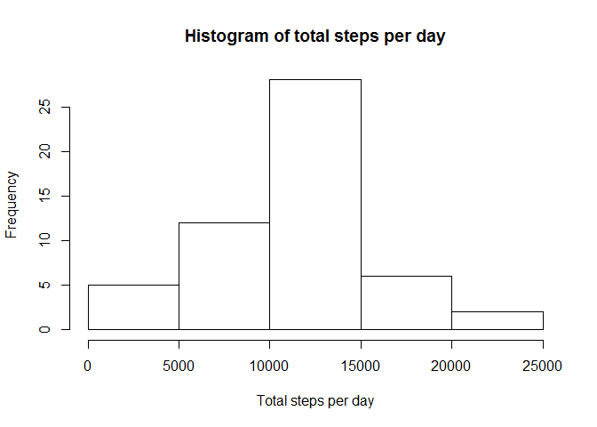
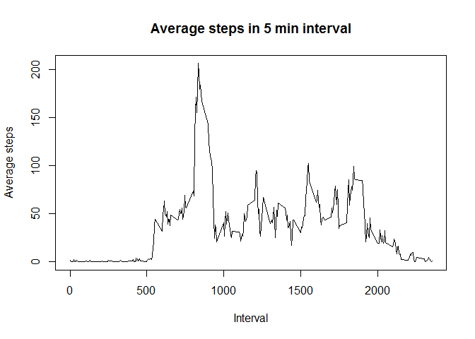
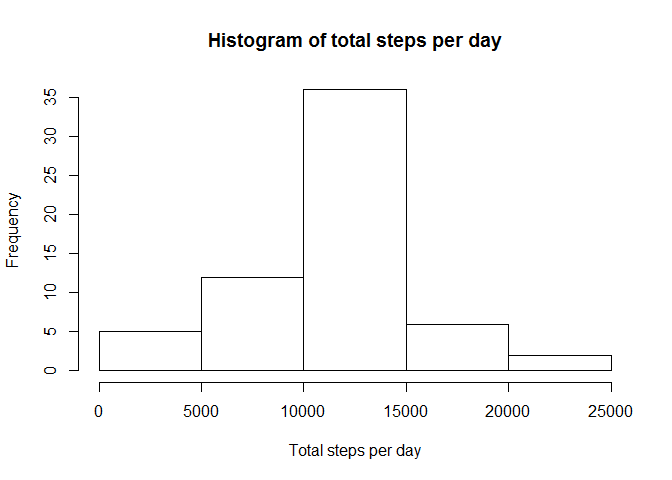
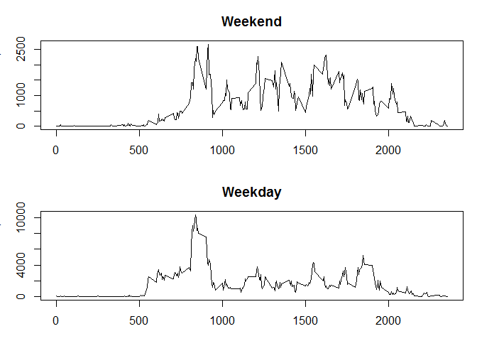

# Reproducible Research - Assignment 1
Boyke  
Saturday, January 17, 2015  

### Loading libraries

```r
library(dplyr)
library(sqldf)
```

### Loading and preprocessing the data
Load the data, process/transform the datainto a format suitable for analysis:


```r
data=read.csv(file="activity.csv", header = TRUE)
data$date <- as.Date(data$date, "%Y-%m-%d")
```

### What is mean total number of steps taken per day?
ignore the missing values in the dataset:


```r
activitydata <- na.omit(data)
```
histogram of the total number of steps taken each day:

```r
grpbydate<-group_by(activitydata, date)
groupedbydate<-summarise(grpbydate, totalstepsday=sum(steps) )

hist(groupedbydate$totalstepsday,xlab="Total steps per day",
     main="Histogram of total steps per day")
```

 

the mean and median total number of steps taken per day.

mean:

```r
mean(groupedbydate$totalstepsday)
```

```
## [1] 10766.19
```
median:

```r
median(groupedbydate$totalstepsday)
```

```
## [1] 10765
```
### What is the average daily activity pattern?
time series plot (i.e. type = "l") of the 5-minute interval (x-axis) and the average number of steps taken, averaged across all days (y-axis):


```r
grpbyinterval<-group_by(activitydata, interval)
groupedbyinterval<-summarise(grpbyinterval, averagesteps=mean(steps) )
plot(groupedbyinterval$interval,groupedbyinterval$averagesteps,type="l",
     xlab="Interval", ylab="Average steps", 
     main="Average steps in 5 min interval")
```

 

5-minute interval containing the maximum number of steps:


```r
sqldf("select interval from groupedbyinterval where averagesteps=
      (select max(averagesteps) from groupedbyinterval)")
```

```
##   interval
## 1      835
```

### Imputing missing values

the total number of missing values(rows) in the dataset:


```r
nrow(data) - nrow(data[complete.cases(data),])
```

```
## [1] 2304
```

double check no NA in other columns. Number of NA in other columns:


```r
nrow(data) - nrow(data[complete.cases(data[,2:3]),])
```

```
## [1] 0
```

Strategy for filling in all of the missing values in the dataset:
mean for that 5-minute interval (across days)

* Create a new dataset that is equal to the original dataset but with the missing data filled in

Code implementing strategy:


```r
NAreplaced <- data
NAreplaced$steps <- ifelse(is.na(NAreplaced$steps), 
                    groupedbyinterval$averagesteps[match(NAreplaced$interval, 
                    groupedbyinterval$interval)], NAreplaced$steps)
```

histogram of the total number of steps taken each day:


```r
grpbydate_no_na<-group_by(NAreplaced, date)
groupedbydate_no_na<-summarise(grpbydate_no_na, totalstepsday=sum(steps) )
hist(groupedbydate_no_na$totalstepsday,xlab="Total steps per day",
     main="Histogram of total steps per day")
```

 

mean of total number of steps taken per day:

```r
mean(groupedbydate_no_na$totalstepsday)
```

```
## [1] 10766.19
```

median of total number of steps taken per day:

```r
median(groupedbydate_no_na$totalstepsday)
```

```
## [1] 10766.19
```

Do the above values differ from the estimates from the first part of the assignment? 

* NO (because of imputing strategy)

What is the impact of imputing missing data on the estimates of the total daily number of steps?

* HIGHER. IN ADDITION MORE DAYS REMAIN IN THE DATASET

### Are there differences in activity patterns between weekdays and weekends?
Create a new factor variable in the dataset with two levels - "weekday" and "weekend" indicating whether a given date is a weekday or weekend day


```r
NAreplaced$weekend <- ifelse(weekdays(NAreplaced$date) == "Saturday" |
                      weekdays(NAreplaced$date) == "Sunday" ,1, 0)
```

panel plot containing a time series plot (i.e. type = "l") of the 5-minute interval (x-axis) and the average number of steps taken, averaged across all weekday days or weekend days (y-axis):


```r
agg<-aggregate(steps ~ interval + weekend, data = NAreplaced, FUN = 'sum')
weekenddata<-subset(agg, agg$weekend == 1) #
weekdata<-subset(agg, agg$weekend == 0)
par(mfrow = c(2, 1))
par(mar=c(3,3,3,1))
plot(weekenddata$interval,weekenddata$steps,type="l",
     xlab="Interval", ylab="Number of steps", 
     main="Weekend")
plot(weekdata$interval,weekdata$steps,type="l",
     xlab="Interval", ylab="Number of steps", 
     main="Weekday")
```

 

